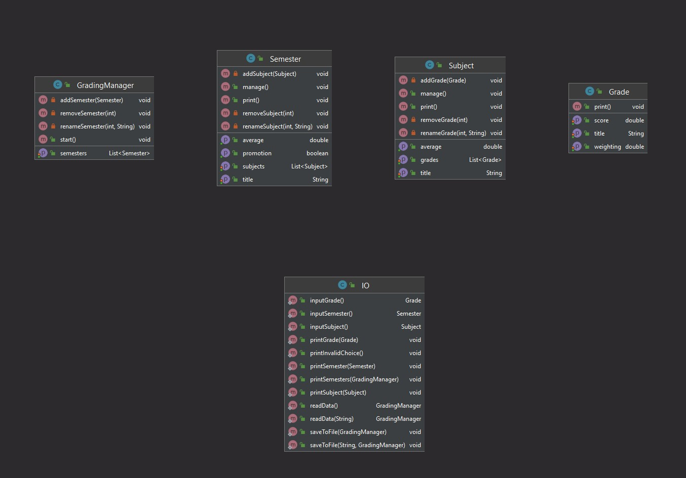
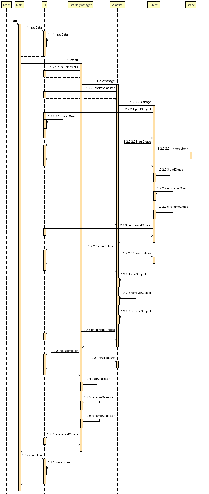

# Grade Manager
The grade manager can be used to manage personal school grades for a single person.  
It can be used to add multiple semesters. In each semester there can be subjects which can contain 
grades. Information about all the data will be displayed in different sections.  
  
The user can go into a deeper view to manage the semesters, subjects or grades.  
  
The whole user interface is accessed through the terminal.  

---

## Use Cases
The following use cases describe, what functionalities are available.

### View (grade|subject|semester)
View the properties of each level of the manager. Data gets printed to the console (i.e: Name with average)

### Add a new school semester
Through the menu a new school semester can be added (*i.e: "Autumn 2021"*)
#### Pre Conditions
The school semester doesn't exist.
#### Post Conditions
A semester is available for further use in the manager.

### Add a subject
Add a new subject to an existing school semester to manage school grades for that specific semester (*i.e: "History"*)
#### Pre Conditions
* A school semester exists
* The school semester is either empty or already filled
#### Post Conditions
* There is a school subject available for further use.

### Add a grade
Add a grade for an exam (or something else) with the weight to a subject. The average grade will be calculated.
#### Pre Conditions
* A school semester with a subject exists
* The subject is either empty or already filled with more grades
#### Post Conditions
* The grade is added to the subject
* An average is calculated and visible

### Delete (grade|subject|semester)
Delete a grade, a semester, or a subject.
#### Pre Conditions
* The grade/subject/semester exists
#### Post Conditions
* The grade/subject/semester doesn't exist anymore
* The deleted object can't be restored

---

## Class Diagram
Image: class_diagram.jpg

---

## Sequence Diagram
Image: sequence_diagram.jpg

---
